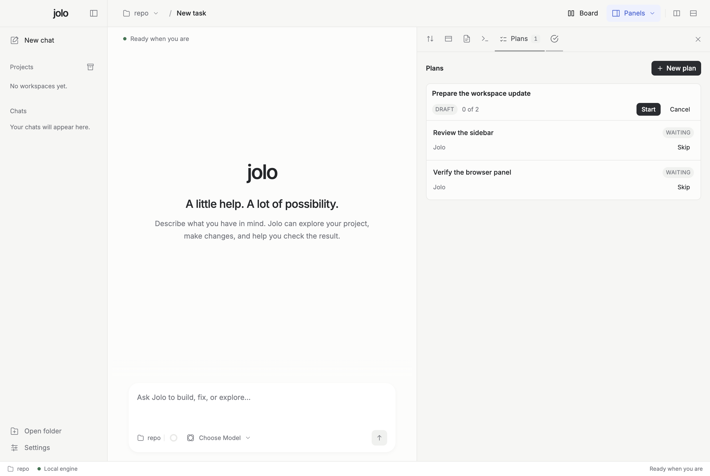

# Jolo

A desktop app and CLI for working with coding agents.

Use Claude Code, Codex, Devin CLI, Grok CLI, Gemini CLI, or your own API provider. Keep your chats, files, terminal, and browser in one workspace.

[Download](https://github.com/jolo-build/jolo/releases/latest) · [Website](https://jolo.build) · [User guide](https://docs.jolo.build) · [Report a bug](https://github.com/jolo-build/jolo/issues)

<picture>
  <source media="(prefers-color-scheme: dark)" srcset="assets/screenshots/jolo-desktop-dark.png">
  <source media="(prefers-color-scheme: light)" srcset="assets/screenshots/jolo-desktop-light.png">
  
</picture>

## What you can do

- Ask an agent to explain code, build a feature, or fix a bug.
- Review changes and run checks beside your chat.
- Open files, a terminal, and a browser without leaving the app.
- Work on several tasks at once, with split views and separate Git worktrees.
- Create a plan, choose an agent for each step, and run the steps in order.
- Attach files and explore diagrams and interactive visualizations.

## Install

**Desktop:** Download the `.dmg` for your Mac from [GitHub Releases](https://github.com/jolo-build/jolo/releases/latest). Open it and drag Jolo into Applications. Apple Silicon and Intel versions are available.

Jolo is in early development. The macOS app is not yet notarized, and automatic updates are not available.

**CLI:** Run this in your terminal:

```sh
curl -fsSL https://jolo.build/install.sh | bash
```

This installs the CLI, not the desktop app. CLI packages are available for macOS and Linux, on ARM64 and x64.

## Start a task

1. Open Jolo and choose a folder, or start a new chat.
2. Choose an agent and model below the message box.
3. Describe what you want to do.
4. Review the agent's work and continue the conversation.

Install and sign in to your coding agent separately before using it in Jolo. You can also configure an API provider.

For Devin, install the [Devin CLI](https://docs.devin.ai/cli/acp/zed) and sign in with `devin auth login`. Restart Jolo, then choose **Devin CLI** or mention `@devin` in chat. Jolo uses your existing local CLI login and reads the available models from Devin.

Prefer the terminal? Open a project with:

```sh
jolo /path/to/project
```

Or run a single task:

```sh
jolo run --agent claude "Explain this repository" --path /path/to/project
```

See the [CLI guide](apps/cli/README.md) for more commands.

## Web tasks

[Jolo Access](https://access.jolo.build) lets you manage personal and team tasks in your browser. Sign in to connect them to the desktop or CLI, then type `#` in chat to reference a task.

An account is optional. You can use Jolo locally without one.

## Run from source

Install the Bun version in [.bun-version](.bun-version), then:

```sh
git clone https://github.com/jolo-build/jolo.git
cd jolo
bun install --frozen-lockfile
bun run desktop
```

For the CLI, use `bun run jolo`.

## Contribute

Bug reports and pull requests are welcome. Read [CONTRIBUTING.md](CONTRIBUTING.md) for development setup and checks, or [SECURITY.md](SECURITY.md) to report a vulnerability.

## License

[MIT](LICENSE). Fonts, [agent icons](assets/brand/agents/LICENSE), and optional components in `vendor/` keep their own licenses.
